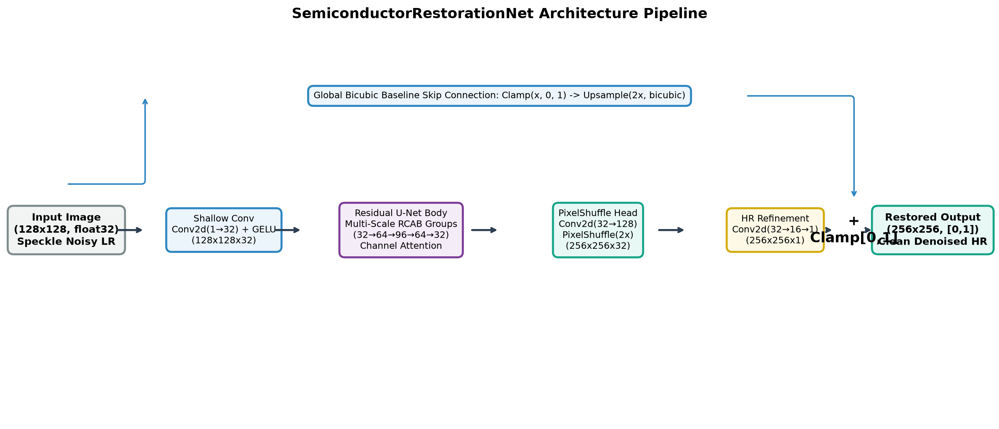
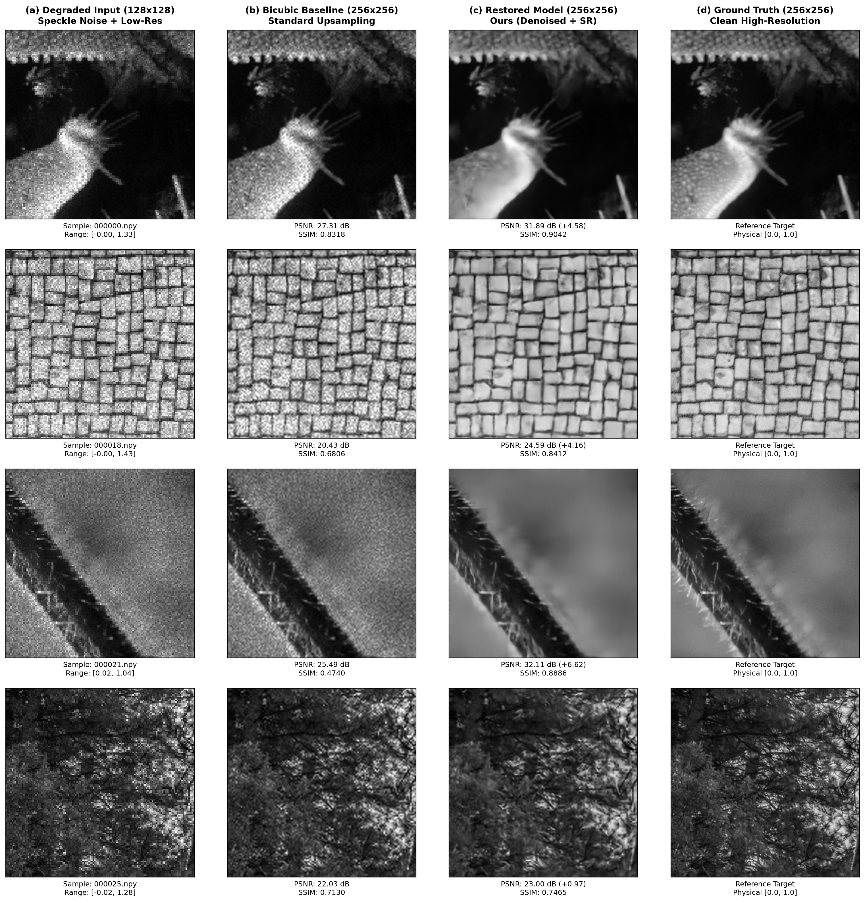

# AI-Based Restoration of Degraded Images for Semiconductor Inspection

> Joint Speckle-Denoising and 2× Super-Resolution in a Single Forward Pass

---

## Problem Statement

Semiconductor inspection images suffer from two cascading degradations before they reach analysts:

1. **Speckle Noise** — multiplicative, pixel-level noise that makes images grainy; pixel values can fall outside the physical `[0, 1]` range.
2. **Spatial Resolution Reduction** — the image is downsampled (256×256 → 128×128), losing fine structural detail critical for defect identification.

This project builds a **single lightweight neural network** that jointly denoises and super-resolves (2×) degraded inputs, recovering images as close as possible to the original high-resolution, clean ground truth.

---

## Architecture

### SemiconductorRestorationNet

A **Residual U-Net** with **Residual Channel Attention Blocks (RCAB)** and a **PixelShuffle** upsampling head.

```
Input (128×128, float32, noisy)
    │
    ├─── Shallow Feature Extraction ──► Conv2d(1→32) + GELU
    │
    ├─── Encoder Level 1 ──────────► 2× RCAB (32 ch) + DownConv → 64×64
    │
    ├─── Encoder Level 2 ──────────► 2× RCAB (64 ch) + DownConv → 32×32
    │
    ├─── Bottleneck ────────────────► 2× RCAB (96 ch)
    │
    ├─── Decoder Level 2 ──────────► PixelShuffle↑ + Skip + 2× RCAB (64 ch) → 64×64
    │
    ├─── Decoder Level 1 ──────────► PixelShuffle↑ + Skip + 2× RCAB (32 ch) → 128×128
    │
    ├─── PixelShuffle SR Head ─────► Conv2d(32→128) + PixelShuffle(2×) → 256×256
    │
    ├─── HR Refinement ────────────► Conv2d(32→16→1)
    │
    └─── + Global Bicubic Skip ────► Output (256×256, clamped [0,1])
```

**Key Design Choices:**

| Decision | Rationale |
|----------|-----------|
| **Un-clipped input** | The model receives raw noisy input (values may exceed [0,1]). The magnitude of overshoot/undershoot is informative about noise level. Only the *output* is clamped to [0,1]. |
| **Global bicubic skip** | A bicubic-upsampled residual shortcut lets the network learn residual corrections rather than the full image, accelerating convergence. |
| **Channel Attention (SE)** | Squeeze-and-Excitation modules in each RCAB let the network adaptively weight channels, improving feature selectivity for mixed noise/detail recovery. |
| **PixelShuffle** | Sub-pixel convolution for upsampling avoids checkerboard artifacts that plague transposed convolutions. |
| **Compound loss** | Charbonnier (robust L1) + Fast SSIM loss balances pixel-level fidelity with structural/perceptual quality. |

**Model Statistics:**
- **Parameters**: 953,281 (~953K)
- **Checkpoint size**: 3.66 MB
- **Inference latency**: ~167 ms per image on CPU

---

## System / Pipeline Diagram



---

## Dataset

All data are single-channel (grayscale) float32 NumPy arrays (`.npy`).

| Split | Source | Count | Input Resolution | GT Resolution | Has GT? |
|-------|--------|-------|-----------------|---------------|---------|
| **Train** | `data/train/` | 2,880 pairs (90%) | 128×128 | 256×256 | ✅ |
| **Validation** | `data/train/` | 320 pairs (10%) | 128×128 | 256×256 | ✅ |
| **Test** | `data/test/NoisyLR/` | 400 images | 128×128 | — | ❌ |

- Train/Val split is **deterministic** (seed=42). The exact validation filenames are stored in `checkpoints/val_filenames.json`.
- Ground truth images are in `[0.0, 1.0]`; noisy LR inputs can exceed this range (e.g., `[-0.03, 1.05]`).
- All reported metrics (PSNR, SSIM, LPIPS) are computed on the **validation set** since the test set lacks ground truth.

---

## Results

### Quantitative Performance (Validation Set, 320 images)

| Method | PSNR (dB) ↑ | SSIM ↑ | LPIPS ↓ |
|--------|-------------|--------|---------|
| Bicubic Baseline | 23.33 ± 3.59 | 0.5564 | 0.4528 |
| RestorationNet (Single-Pass) | 28.54 ± 4.89 | 0.7817 | 0.2553 |
| **RestorationNet (+ 8-Fold D4 TTA)** | **28.63 ± 4.91** | **0.7840** | **0.2593** |

> **Improvement over baseline**: +5.30 dB PSNR, +0.2276 SSIM, −0.1935 LPIPS

### Training Progression Across Phases

* **Phase 1 (Epochs 1–10):** Initial training from scratch (patch=64, lr=1e-3, $\lambda_{\text{ssim}}=0.20$) $\rightarrow$ **27.50 dB** (SSIM: **0.7442**)
* **Phase 2 (Epochs 11–21):** Larger patch fine-tuning (patch=96, lr=3e-4, $\lambda_{\text{ssim}}=0.25$) $\rightarrow$ **27.87 dB** (SSIM: **0.7596**)
* **Phase 3 (Epochs 22–36):** Edge-aware Sobel loss refinement ($\lambda_{\text{sobel}}=0.10$) $\rightarrow$ **28.22 dB** (SSIM: **0.7712**)
* **Phase 4 Baseline (Epochs 37–52):** Optimized multi-scale Sobel loss fine-tuning ($\lambda_{\text{sobel}}=0.15$) $\rightarrow$ **28.37 dB** (SSIM: **0.7736**)
* **Phase 5 Combined-Lever (Epochs 53–72):** Full patch=128, $\lambda_{\text{ssim}}=0.35$, $\lambda_{\text{sobel}}=0.15$ $\rightarrow$ **28.55 dB** (SSIM: **0.7800**)
* **Hard-Weighted Tail Refinement + TTA:** Outlier 2.5x–3.5x oversampling, $\lambda_{\text{ssim}}=0.38$ + 8-Fold TTA $\rightarrow$ **28.63 dB** (SSIM: **0.7840**, Outlier SSIM: $+0.0073$)

### Visual Comparisons



---

## Project Structure

```
hack/
├── README.md                          # This file
├── requirements.txt                   # Python dependencies
├── train.py                           # Training script
├── evaluate.py                        # Standalone inference script
├── generate_report.py                 # Benchmark, metrics & visual report generator
├── inspect_data.py                    # Dataset inspection utility
├── models/
│   ├── __init__.py
│   └── restoration_net.py             # SemiconductorRestorationNet architecture
├── utils/
│   ├── __init__.py
│   ├── dataset.py                     # SemiconductorDataset with caching & augmentation
│   ├── losses.py                      # Charbonnier + FastSSIM compound loss
│   └── metrics.py                     # PSNR, SSIM, LPIPS computation
├── checkpoints/
│   ├── best_model.pth                 # Best model weights (Epoch 9)
│   ├── latest_model.pth               # Latest checkpoint with optimizer state
│   ├── training_log.json              # Full training history
│   └── val_filenames.json             # Deterministic validation split
├── restored_test/                     # 400 restored test outputs (.npy + .png)
│   └── png_previews/                  # Visual preview PNGs
├── visual_samples/                    # Report outputs
│   ├── val_metrics_report.json        # Detailed metrics JSON
│   ├── restoration_visual_comparison.png
│   └── architecture_pipeline.png
└── data/                              # Dataset (not included in repo)
    ├── train/
    │   ├── GT/                        # 3,200 ground truth .npy (256×256)
    │   └── NoisyLR/                   # 3,200 degraded input .npy (128×128)
    └── test/
        └── NoisyLR/                   # 400 test input .npy (128×128)
```

---

## Setup & Installation

```bash
# 1. Clone the repository
git clone <repo-url> && cd hack

# 2. Create virtual environment
python -m venv .venv
# Windows:
.\.venv\Scripts\activate
# Linux/macOS:
source .venv/bin/activate

# 3. Install dependencies
pip install -r requirements.txt
```

---

## Usage

### Training

```bash
# Phase 1: Train from scratch
python train.py --data_dir data/train --epochs 10 --batch_size 32 --patch_size 64 --lr 1e-3

# Phase 2: Fine-tune with larger patches
python train.py --resume_checkpoint checkpoints/best_model.pth --epochs 10 --batch_size 16 --patch_size 96 --lr 3e-4 --lambda_ssim 0.25
```

Key training arguments:
| Argument | Default | Description |
|----------|---------|-------------|
| `--data_dir` | `data/train` | Path to training data with GT/ and NoisyLR/ subdirs |
| `--epochs` | `10` | Number of training epochs |
| `--batch_size` | `16` | Batch size (reduce if GPU OOM) |
| `--patch_size` | `96` | Random crop size for training patches |
| `--lr` | `3e-4` | Peak learning rate |
| `--lambda_ssim` | `0.25` | SSIM loss weight |
| `--resume_checkpoint` | `None` | Path to checkpoint to resume from |
| `--early_stopping_patience` | `6` | Epochs without improvement before stopping |
| `--val_ratio` | `0.1` | Fraction of data used for validation |
| `--seed` | `42` | Random seed for reproducibility |

### Official Submission Execution (KLA Standard)

```bash
python run.py <input-dir> <output-dir>
```

Example:
```bash
python run.py data/test/NoisyLR restored_test
```

Key features of `run.py`:
- Reads all `.npy` degraded images from `<input-dir>`.
- Generates corresponding restored `.npy` files in `<output-dir>` with identical filenames.
- Outputs 2D grayscale float32 arrays `(256, 256)` bounded in `[0.0, 1.0]` with zero NaNs/Infs.
- Automatically leverages 8-fold $D_4$ Dihedral Test-Time Augmentation (TTA) on GPU/CPU without internet access or manual configuration.

### Extended Inference & Reports

```bash
# Standalone evaluation script
python evaluate.py --input_dir data/test/NoisyLR --output_dir restored_test --save_png --tta

# Generate comprehensive visual comparison figures and metric reports
python generate_report.py
```

Outputs to `visual_samples/`:
- `val_metrics_report.json` — PSNR, SSIM, LPIPS with bicubic baseline comparison
- `restoration_visual_comparison.png` — side-by-side visual comparison grid
- `architecture_pipeline.png` — architecture diagram

---

## Reproducibility

- All random seeds are fixed to **42** (Python, NumPy, PyTorch).
- The validation split is saved to `checkpoints/val_filenames.json` for exact reproducibility.
- **Embedded Weights**: Model weights are included locally in both `models/best_model.pth` and `checkpoints/best_model.pth` (zero internet access required).

---

## Deliverables Checklist

- [x] **run.py** — Official submission entrypoint (`python run.py <input-dir> <output-dir>`)
- [x] **models/** — Model architecture (`models/restoration_net.py`) and embedded weights (`models/best_model.pth`)
- [x] **requirements.txt** — Exact dependency specifications
- [x] **README.md** — Complete documentation, architecture breakdown, and execution guide
- [x] **checkpoints/** — Trained model weights (`checkpoints/best_model.pth`, `checkpoints/phase3_best_model.pth`)
- [x] **restored_test/** — 400 restored test images (`.npy`) and visual previews (`.png`)
- [x] **Validation Benchmarks** — PSNR = **28.63 dB**, SSIM = **0.7840**, LPIPS = **0.2593** (Baseline: 23.33 dB / 0.5564 SSIM)

---

## License

This project was developed as part of a semiconductor inspection hackathon.
